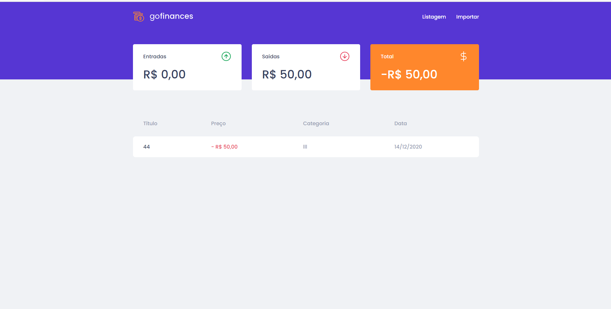

# GoFinances

## ReactJS

❤🇺🇸🇺🇸 📋✅

### Transaction management application.

### This will be an application that should store incoming and outgoing financial transactions and allow the registration and listing of these transactions, in addition to allowing the creation of new records in the database by sending a csv file.

## INSTALL PACKPAGE

### yarn 

## RUN PROJECT

### yarn start

